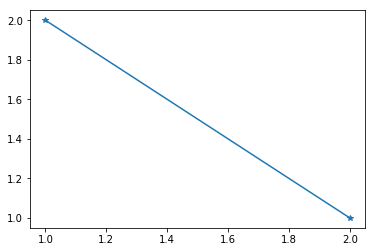

.. _gallery_auto_examples_nb_example_notebook.ipynb:

Comment écrire un notebook ?
============================

Déjà, on import les librairies python kivonbien®.

.. code:: ipython3

    import matplotlib.pyplot as plt

Et ensuite, on trace ce que l'on veut. Par exemple on peut même écrire
des maths :

.. math::

   E = mc^2

.. code:: ipython3

    plt.plot([1,2],[2,1], marker="*")

.. parsed-literal::

    [<matplotlib.lines.Line2D at 0x7f2e08293128>]

.. only:: html

    .. container:: sphx-glr-download

        **Download python file:** :download:`example_Notebook.py`

        **Download IPython notebook:** :download:`example_Notebook.ipynb`
